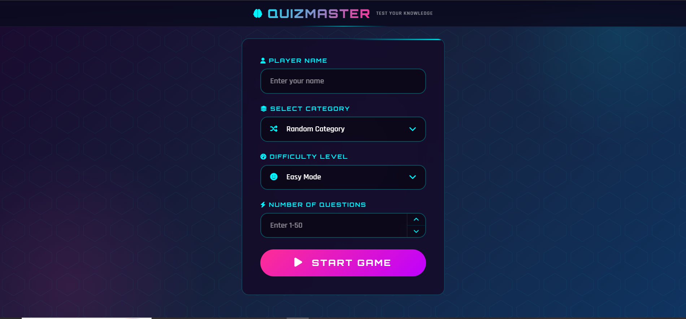

# QuizMaster

An interactive and responsive Quiz Application built with **HTML**, **CSS**, and **Vanilla JavaScript** using the **Open Trivia Database (OpenTDB) API**.

## Preview



---

## Features

- Multiple quiz categories
- Random category option
- Difficulty selection (Easy, Medium, Hard)
- Custom number of questions
- Countdown timer for each question
- Instant answer feedback
- Score tracking system
- High Scores leaderboard
- Local Storage support
- Responsive design
- Smooth question transitions
- Keyboard shortcuts support

---

## Technologies Used

- HTML5
- CSS3
- JavaScript (ES6+)
- Open Trivia Database API
- Local Storage

---

## Project Structure

```text
QuizMaster/
│
├── CSS/
│   └── style.css
│
├── js/
│   ├── index.js
│   ├── quiz.js
│   └── question.js
│
├── images/
│
├── sounds/
│
├── index.html
├── preview.png
└── README.md
```

---

## How It Works

1. Enter your name.
2. Choose a category.
3. Select difficulty level.
4. Choose the number of questions.
5. Start the quiz.
6. Answer questions before the timer runs out.
7. View your final score.
8. Compete for a place in the High Scores leaderboard.

---

## API Used

Open Trivia Database (OpenTDB)

https://opentdb.com/

Example Endpoint:

```javascript
https://opentdb.com/api.php?amount=10&difficulty=easy
```

---

## High Scores

QuizMaster saves the top scores using browser Local Storage.

Stored data includes:

- Player Name
- Score
- Percentage
- Difficulty
- Date

---

## Future Improvements

- Dark / Light Theme
- Question Categories Statistics
- Multiplayer Mode
- Sound Settings
- Custom Timer Options

---

## Live Demo

🚀 [Open QuizMaster](https://nada-mahrous.github.io/QuizMaster/)

---

## Author

Developed by Hossam
